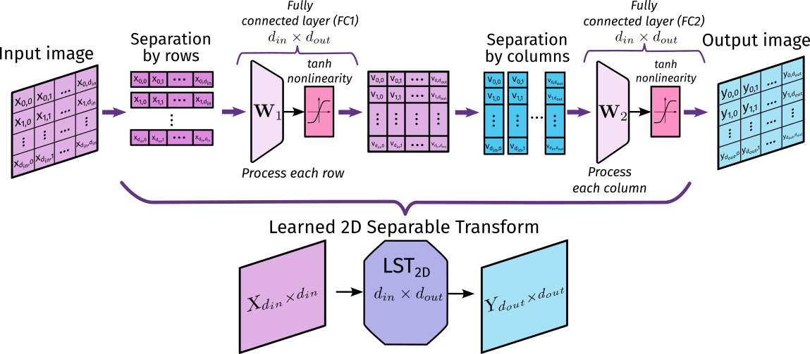

# Learned 2D Separable Transform
The repository contains source code for learned two-dimensional separable transform (LST) that can be considered as a new type
of computational layer for constructing neural network (NN)
architecture for image recognition tasks. The LST based on the
idea of sharing the weights of one fullyconnected (FC) layer to
process all rows of an image.



## Key feature
The use of LST layers in a NN architecture significantly reduces the number of model parameters compared to models that use stacked FC layers. We show that a NN-classifier based on a single LST layer followed by an FC layer achieves 98.02% accuracy on the MNIST dataset, while having only 9.5k parameters.

[Slides (in Russian)](pdf/DSPA2025_vm_ke.pdf)

# Source
In ```src``` folder you can find PyTorch implementation of LST layer and three NNs: LST-1, LST-2 and ResLST-3.

# Cite
M. Vashkevich, E. Krivalcevich _Compact and Efficient Neural Networks for Image Recognition Based on Learned 2D Separable Transform_ in Proc. 27th International Conference on Digital Signal Processing and its Applications (DSPA), 2025, P. 1–6.