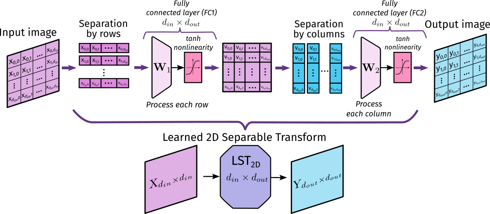
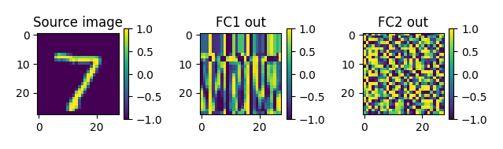

# LST-2D — Learned 2D Separable Transform

[](pdf/DSPA2025_vm_ke.pdf)
[](https://doi.org/10.1109/DSPA64310.2025.10977914)
[](https://www.python.org/)
[](https://pytorch.org/)
[](http://yann.lecun.com/exdb/mnist/)
[](#results)
[](#results)
[](LICENSE)

Reference implementation of the **Learned 2D Separable Transform (LST)** — a compact, weight-sharing alternative to fully-connected layers — and three lightweight neural network architectures (LST-1, LST-2, ResLST-3) for handwritten digit recognition on MNIST.

> **Vashkevich M., Krivalcevich E.** *Compact and Efficient Neural Networks for Image Recognition Based on Learned 2D Separable Transform.* In Proc. 27th International Conference on Digital Signal Processing and its Applications (DSPA), 2025, pp. 1–6. [doi:10.1109/DSPA64310.2025.10977914](https://doi.org/10.1109/DSPA64310.2025.10977914)

<p align="center">
  
</p>

---

## Table of Contents

- [Motivation](#motivation)
- [Method](#method)
- [Results](#results)
- [Repository structure](#repository-structure)
- [Installation](#installation)
- [Usage](#usage)
- [Pretrained models](#pretrained-models)
- [FPGA implementation](#fpga-implementation)
- [Citation](#citation)
- [Authors](#authors)
- [License](#license)

---

## Motivation

Compact and high-performance neural-network implementations are critical for resource-constrained platforms such as FPGAs, where on-chip memory is limited and storing large weight tensors in external DRAM is costly. Among the standard parameter-reduction techniques — quantization, pruning, and weight sharing — **weight sharing** is particularly attractive because it reduces both parameter count and memory traffic without changing the numeric format.

LST extends the weight-sharing idea (well known from convolutional layers) to fully-connected layers: a single FC layer is reused to process every row of the input image, then a second shared FC layer processes every column of the resulting representation. The result is a compact 2D-to-2D transform whose parameter count grows linearly — not quadratically — with image side length.

## Method

Given an input image $\mathbf{X} \in \mathbb{R}^{d_\text{in}\times d_\text{in}}$, an LST block produces an output $\mathbf{Y} \in \mathbb{R}^{d_\text{out}\times d_\text{out}}$ via two shared FC layers:

$$
\mathbf{Y} \;=\; \mathrm{LST}_{d_\text{in}\times d_\text{out}}(\mathbf{X}) \;=\; \tanh\!\big(\mathbf{W}_2 \, \tanh(\mathbf{W}_1 \mathbf{X}^\top)\big)
$$

The number of learnable parameters is $N = 2(d_\text{in}+1)\,d_\text{out}$ — independent of the spatial dimension squared.

Three architectures built from LST blocks are included:

| Model      | Composition                                                                                    | Reference                                |
|------------|------------------------------------------------------------------------------------------------|------------------------------------------|
| **LST-1**  | One LST block + FC + softmax                                                                   | [`LST_1`](src/l2dst_lib/lst_nn.py)       |
| **LST-2**  | Two stacked LST blocks + FC + softmax                                                          | [`LST_2`](src/l2dst_lib/lst_nn.py)       |
| **ResLST-3** | Three LST blocks with a ResNet-style skip connection + FC + softmax                          | [`ResLST`](src/l2dst_lib/lst_nn.py)      |

## Results

Evaluation on the MNIST test set (10 000 images, 28×28 grayscale). All LST models trained for 300 epochs with Adam (lr = 2e-3, weight decay = 1e-5), batch size 1000, Glorot initialization.

| Architecture                       | Parameters | Accuracy   | Notes                              |
|------------------------------------|-----------:|-----------:|------------------------------------|
| Huynh, 784-40-40-40-10             |     34 960 |   97.20 %  | reference FFNN                     |
| Huynh, 784-126-126-10              |    115 920 |   98.16 %  | reference FFNN                     |
| Westby et al., 784-12-10           |      9 550 |   93.25 %  | comparable size, lower accuracy    |
| Umuroglu et al., 784-1024-1024-10  |  1 863 690 |   98.40 %  | LFC-max (FINN)                     |
| Medus et al., 784-600-600-10       |    891 610 |   98.63 %  | systolic FFNN                      |
| Liang et al., 784-2048³-10         | 10 100 000 |   98.32 %  | FP-BNN baseline                    |
| **LST-1** *(this work)*            |  **9 474** | **98.02 %**| ≈ 12× fewer params than Huynh-126  |
| **LST-2** *(this work)*            | **11 098** | **98.34 %**| ≈ 900× fewer params than Liang     |
| **ResLST-3** *(this work)*         | **12 722** | **98.53 %**| ≈ 146× fewer params than LFC-max   |

> **Headline:** LST-1 reaches 98 %+ accuracy with under 10 K parameters — an order of magnitude smaller than any FFNN of comparable accuracy.

## Repository structure

```
LST-2d/
├── src/
│   ├── l2dst_lib/
│   │   ├── __init__.py
│   │   └── lst_nn.py           # L2DST layer + LST-1 / LST-2 / ResLST models
│   ├── models/                 # pretrained checkpoints (300 epochs)
│   │   ├── LST_1_epoch_300.pth
│   │   ├── LST_2_epoch_300.pth
│   │   └── ResLST_epoch_300.pth
│   └── LST-NN-test.ipynb       # train / evaluate / visualize embeddings
├── img/                        # figures used in the README
├── pdf/
│   └── DSPA2025_vm_ke.pdf      # conference slides (in Russian)
├── LICENSE                     # GNU GPL v3.0
└── README.md
```

## Installation

```bash
git clone https://github.com/<your-org>/LST-2d.git
cd LST-2d
python -m venv .venv
# Windows: .venv\Scripts\activate
source .venv/bin/activate
pip install torch torchvision numpy matplotlib tqdm jupyter
```

A CUDA-enabled PyTorch build is recommended for training but not required — the models are small enough to train on CPU in reasonable time.

## Usage

### Quick start (Python)

```python
import torch
from l2dst_lib.lst_nn import LST_1, LST_2, ResLST

device = "cuda" if torch.cuda.is_available() else "cpu"

model = LST_1(input_size=28, num_classes=10, device=device).to(device)
state = torch.load("src/models/LST_1_epoch_300.pth", map_location=device)
model.load_state_dict(state)
model.eval()

x = torch.randn(1, 28, 28, device=device)   # batched 28×28 input
logits = model(x)
pred = logits.argmax(dim=1)
```

### Training and evaluation notebook

The end-to-end training pipeline, evaluation on the MNIST test set, and embedding visualisations are reproduced in [`src/LST-NN-test.ipynb`](src/LST-NN-test.ipynb):

```bash
cd src
jupyter notebook LST-NN-test.ipynb
```

## Pretrained models

Checkpoints trained for 300 epochs are provided under [`src/models/`](src/models/) and reproduce the accuracies in the [Results](#results) table:

| File                        | Architecture | Test accuracy |
|-----------------------------|--------------|--------------:|
| `LST_1_epoch_300.pth`       | LST-1        | 98.02 %       |
| `LST_2_epoch_300.pth`       | LST-2        | 98.34 %       |
| `ResLST_epoch_300.pth`      | ResLST-3     | 98.53 %       |

### Embedding visualisation

The `get_embeddings()` helper of [`L2DST`](src/l2dst_lib/lst_nn.py) returns the intermediate row- and column-shared representations, making it possible to inspect what the transform learns:

<p align="center">
  
</p>

## FPGA implementation

The paper also reports an FPGA realization of LST-1 on a Xilinx Zybo Z7 (XC7Z010) using Vivado 2023.2 and PYNQ. With 12-bit fixed-point weights (Q5.7), the implementation requires **6 473 LUTs (36.8 %)**, **680 FFs (1.9 %)** and **29 RAMB18 (24.2 %)**, with **no accuracy loss** relative to the floating-point model. The HDL sources are maintained in a separate repository and are not included here.

## Citation

If you use this code or build on the LST layer, please cite:

```bibtex
@inproceedings{Vashkevich2025LST,
  author    = {Vashkevich, Maxim and Krivalcevich, Egor},
  title     = {Compact and Efficient Neural Networks for Image Recognition
               Based on Learned {2D} Separable Transform},
  booktitle = {Proc. 27th International Conference on Digital Signal Processing
               and its Applications (DSPA)},
  year      = {2025},
  pages     = {1--6},
  doi       = {10.1109/DSPA64310.2025.10977914}
}
```

Conference slides (in Russian) are available in [`pdf/DSPA2025_vm_ke.pdf`](pdf/DSPA2025_vm_ke.pdf).

## Authors

- **Maxim Vashkevich** — *vashkevich@bsuir.by*
- **Egor Krivalcevich** — *krivalcevi4.egor@gmail.com*

Department of Computer Engineering, Belarusian State University of Informatics and Radioelectronics (BSUIR), Minsk, Belarus.

The authors thank the **Engineering Center YADRO** (HTP resident) for providing equipment for the experiments within the joint educational laboratory with BSUIR.

## License

This project is licensed under the **GNU General Public License v3.0** — see [`LICENSE`](LICENSE) for details.
